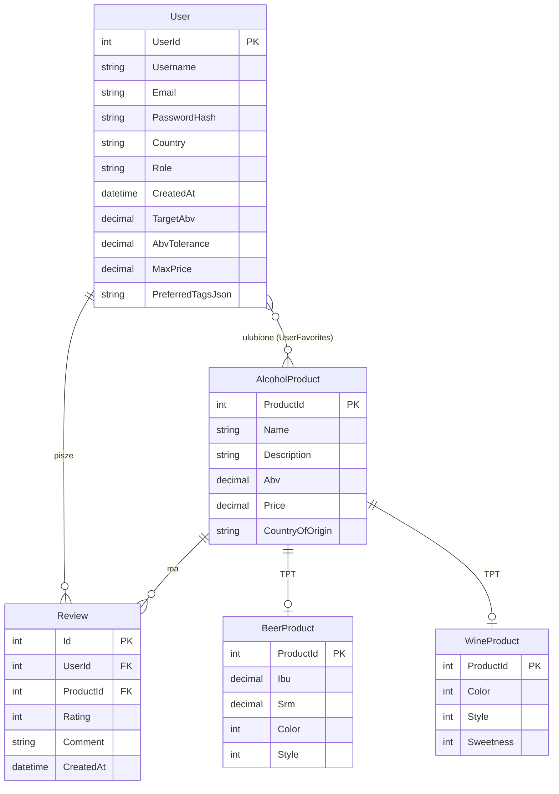

# Titan Project

## Idea projektu

Projekt to aplikacja webowa, czyli katalog alkoholi (piwo i wino) z rekomendacjami.
Użytkownik może się zarejestrować, przeglądać katalog, dodawać napoje do ulubionych
oraz wystawiać opinie i oceny. Na podstawie preferencji smakowych użytkownika
system pokazuje mu rekomendacje podobnych napojów. Administrator ma możliwość
dodawania, edycji i usuwania produktów.

Aplikacja składa się z dwóch części: REST API (backend) oraz osobnego frontendu.
Komunikują się one ze sobą tylko przez HTTP/JSON.

## Stos technologiczny

**Backend**
- .NET 10 / ASP.NET Core Web API
- Entity Framework Core + PostgreSQL
- Uwierzytelnianie przez ciasteczka (cookie), role: Admin, Moderator, User
- .NET Aspire (uruchamianie serwera i frontendu razem)

**Frontend**
- React 19 + TypeScript
- Vite
- React Router

**Struktura rozwiązania**
- `Titan_Project.Server` to Web API (kontrolery, serwisy, EF Core)
- `TitanClassLibrary` to model domenowy, enumy, DTO oraz `AppDBContext`
- `Titan_Project.AppHost` to host Aspire
- `frontend` to aplikacja React (SPA)

## Architektura

System jest podzielony na warstwy. Frontend nigdy nie łączy się z bazą danych
bezpośrednio, wszystko idzie przez REST API.

```
Frontend (React, Vite)
        |
        |  HTTP / JSON  (/api/...)
        v
Backend (ASP.NET Core Web API)
   Kontrolery  ->  Serwisy / Repozytoria  ->  Model domenowy
        |
        |  EF Core
        v
PostgreSQL
```

Warstwy w backendzie:
- **Kontrolery** odbierają żądania HTTP, walidują dane i zwracają kody statusu.
- **Warstwa aplikacji** (`Application/Auth`, `Application/Abstractions`) zawiera
  logikę uwierzytelniania i interfejsy serwisów.
- **Infrastruktura** (`Infrastructure/Data`, `Infrastructure/Auth`, `Infrastructure/Seeding`)
  to `AppDBContext`, hashowanie haseł, kontekst zalogowanego użytkownika i seedowanie danych.
- **Domena** (`Domain/Model`, `Domain/Enums`) to encje z walidacją w setterach.

Dane są przechowywane trwale w PostgreSQL. Dziedziczenie produktów jest mapowane
strategią Table-Per-Type, czyli osobne tabele dla bazy i typów pochodnych.

## Model domenowy (klasy)

**`AlcoholProduct`** (klasa abstrakcyjna, bazowa)
- `ProductId`, `Name`, `Description`, `Abv`, `Price`, `CountryOfOrigin`
- `Category` (abstrakcyjna) oraz `Favorites` (powiązanie z użytkownikami)
- walidacja pól odbywa się w setterach

**`BeerProduct : AlcoholProduct`**
- `Ibu`, `Srm`, `Color` (`BeerColor`), `Style` (`BeerStyle`)

**`WineProduct : AlcoholProduct`**
- `Color` (`WineColor`), `Style` (`WineStyle`), `Sweetness` (`WineSweetness`), `Aromas`

**`User`**
- `UserId`, `Username`, `Email`, `PasswordHash`, `Country`, `Role`, `CreatedAt`
- `Favorites`, czyli ulubione napoje
- preferencje smakowe: `TargetAbv`, `AbvTolerance`, `MaxPrice`, `PreferredTagsJson`

**`Review`**
- `Id`, `UserId`, `ProductId`, `Rating` (od 1 do 5), `Comment`, `CreatedAt`

**Enumy**
- `AlcoholCategory` (Beer / Wine)
- Piwo: `BeerColor`, `BeerStyle`, `BeerStyleFamily`
- Wino: `WineColor`, `WineStyle`, `WineSweetness`, `WineAroma`

## Diagram ERD



## Endpointy

Bazowy adres: `http://localhost:5542`. Wszystkie dane w formacie JSON.
Pełna, zawsze aktualna dokumentacja API jest dostępna pod adresem `/scalar/v1`
(interfejs Scalar), a sam plik OpenAPI pod `/openapi/v1.json`.

Oznaczenia: L wymaga zalogowania, R wymaga roli Admin lub Moderator.

### Auth `/api/auth`
| Metoda | Ścieżka | Dostęp | Opis |
|--------|---------|--------|------|
| POST | `/api/auth/register` |        | Rejestracja użytkownika |
| POST | `/api/auth/login` |        | Logowanie, ustawia cookie sesji |
| POST | `/api/auth/logout` | L      | Wylogowanie |
| GET | `/api/auth/me` | L      | Dane zalogowanego użytkownika |

### Użytkownicy `/api/users`
| Metoda | Ścieżka | Dostęp | Opis |
|--------|---------|--------|------|
| GET | `/api/users/{userId}` | | Pobranie użytkownika po id |

### Produkty `/api/products`
| Metoda | Ścieżka | Dostęp | Opis |
|--------|---------|--------|------|
| GET | `/api/products` | | Lista produktów |
| GET | `/api/products/{id}` | | Produkt po id |

### Opinie `/api/reviews`
| Metoda | Ścieżka | Dostęp | Opis |
|--------|---------|--------|------|
| GET | `/api/reviews/product/{productId}` |        | Opinie dla produktu |
| POST | `/api/reviews` | L      | Dodanie lub aktualizacja własnej opinii |
| PUT | `/api/reviews/{reviewId}` | L      | Edycja własnej opinii |
| DELETE | `/api/reviews/{reviewId}` | L      | Usunięcie własnej opinii |

### Ulubione `/api/favorites`
| Metoda | Ścieżka | Dostęp | Opis |
|--------|---------|--------|------|
| GET | `/api/favorites` | L      | Ulubione użytkownika |
| POST | `/api/favorites/{productId}` | L      | Dodanie do ulubionych |
| DELETE | `/api/favorites/{productId}` | L      | Usunięcie z ulubionych |

### Biblioteka `/api/library`
| Metoda | Ścieżka | Dostęp | Opis |
|--------|---------|--------|------|
| GET | `/api/library` | L      | Biblioteka i preferencje użytkownika |
| PUT | `/api/library/prefs` | L      | Zapis preferencji smakowych |

### Rekomendacje `/api/recommendations`
| Metoda | Ścieżka | Dostęp | Opis |
|--------|---------|--------|------|
| GET | `/api/recommendations/{productId}` | | Produkty podobne do danego |
| GET | `/api/recommendations/for-user` | | Rekomendacje dla użytkownika |

### Katalog piwa `/api/beer-catalog`
| Metoda | Ścieżka | Opis |
|--------|---------|------|
| GET | `/api/beer-catalog/families` | Rodziny stylów piwa |
| GET | `/api/beer-catalog/families/{code}` | Rodzina po kodzie |
| GET | `/api/beer-catalog/colors` | Kolory piwa |
| GET | `/api/beer-catalog/colors/{code}` | Kolor po kodzie |
| GET | `/api/beer-catalog/styles/{code}` | Styl po kodzie |

### Katalog wina `/api/wine-catalog`
| Metoda | Ścieżka | Opis |
|--------|---------|------|
| GET | `/api/wine-catalog/styles` | Style wina |
| GET | `/api/wine-catalog/colors` | Kolory wina |
| GET | `/api/wine-catalog/sweetness` | Poziomy słodkości |
| GET | `/api/wine-catalog/aromas` | Lista aromatów |

### Panel administratora `/api/admin` R
| Metoda | Ścieżka | Opis |
|--------|---------|------|
| POST | `/api/admin/products` | Dodanie produktu (piwo lub wino) |
| PUT | `/api/admin/products/{id}` | Edycja produktu |
| DELETE | `/api/admin/products/{id}` | Usunięcie produktu |
| GET | `/api/admin/catalog-beer/suggest` | Podpowiedzi do uzupełniania formularza |
| GET | `/api/admin/catalog-beer/details/{beerId}` | Szczegóły piwa z zewnętrznego źródła |
| GET | `/api/admin/image-search` | Wyszukiwanie obrazków do formularza |

### Kody statusu HTTP
`200 OK`, `201 Created`, `204 No Content`, `400 Bad Request`,
`401 Unauthorized`, `403 Forbidden`, `404 Not Found`, `409 Conflict`,
`500` (jako `ProblemDetails`).